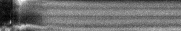
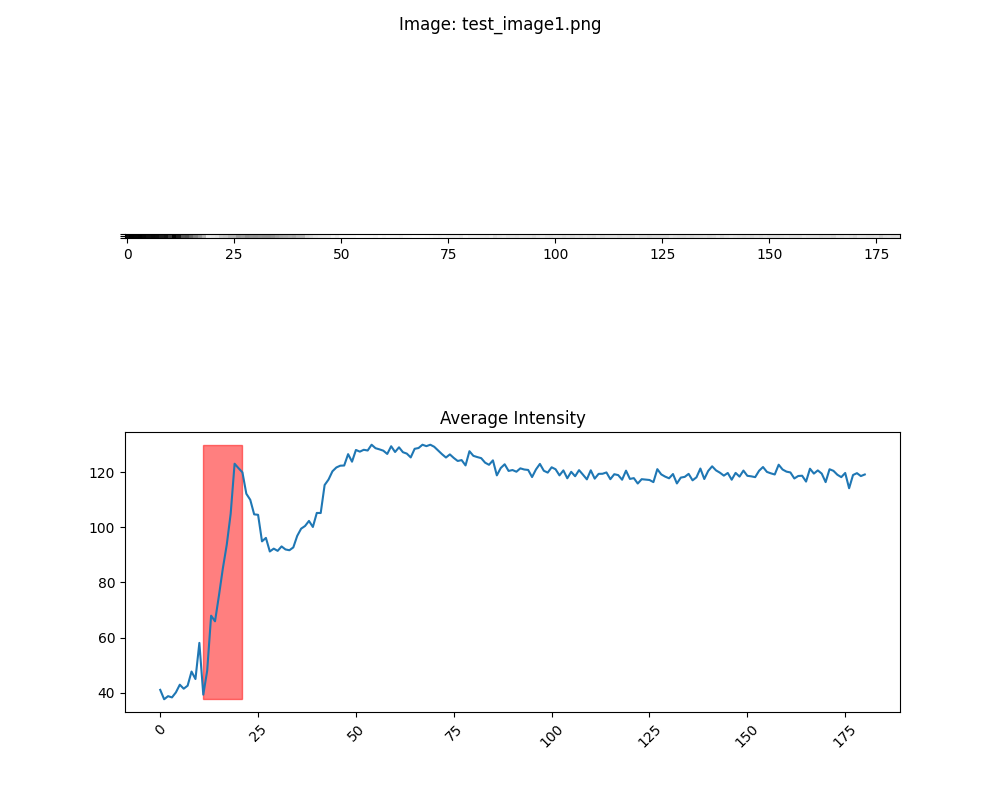

# Pymograph

Sample Kymograph made using Fiji

Generated result

## Overview 
Pymograph takes in raw data from the PNG data of Kymographs, and generates quantitative graphs to map increases in light intensity. You can generate these Kymographs using a tool like [Fiji (aka ImageJ)](https://imagej.net/software/fiji/)

If you have any questions or find any issues/bugs please report them in the [issues tab](https://github.com/nakajimayoshi/pymograph/issues)

## Instructions

Requirements: 
- [Python 3.4 or higher](https://www.python.org/downloads/)

---
1. Download the .zip file or clone the repository
2. Remove the sample images & graphs from the "images" and "graphs" folders
3. Add your Kymographs to the "images" folder 
4. Run the following command in the terminal: 
    `pip3 install -r requirements.txt`
5. Run the program by typing `python3 main.py` in the terminal

You will find your results in the "graphs" directory as well as a .csv file in the root directory with the raw averaged data. 

### Optional 
You can adjust the "column_range" parameter to adjust how smooth you want the captured rolling average to be. E.g. setting it to 5 results in finding the largest increase across 5 frames.

## Methodology 

Sure, here is an API-style documentation for your `Kymograph` class:

---

# Class: Kymograph

A class to generate and analyze kymographs from a set of images.

## Methods

### `__init__` 

Initializes the Kymograph instance and sets up a logger.

**Parameters**: None

**Returns**: None

---

### `flatten(image_data: np.ndarray) -> np.ndarray`

Converts an image into a one-dimensional array with the average intensity of each column.

**Parameters**:
- `image_data` (np.ndarray): A 2D array representing the image.

**Returns**: A 1D NumPy array with the average intensity of each column in the image.

---

### `max_increase_column(averages: np.ndarray, column_range: int) -> int`

Finds the column index with the maximum increase in pixel intensity over a specified range.

**Parameters**:
- `averages` (np.ndarray): A 1D array of average intensities for an image.
- `column_range` (int): The range over which to calculate the increase in intensity.

**Returns**: The column index where the maximum increase starts.

---

### `save_to_csv(image_folder: str, csv_filename: str = "results.csv")`

Calculates the average intensity of each image in a folder and saves the data to a CSV file.

**Parameters**:
- `image_folder` (str): The path to the folder with the images.
- `csv_filename` (str, optional): The filename for the CSV file. Defaults to "results.csv".

**Returns**: None

---

### `graph_averages(image: str, column_range: int)`

Generates a two-part figure for an image and saves it to a 'graphs' directory. 

**Parameters**:
- `image` (str): The path to the image.
- `column_range` (int): The range over which to calculate the increase in intensity for highlighting the area of maximum increase.

**Returns**: None

---

### `generate_intensity_graphs(image_folder: str, column_range: int)`

Processes all images in a folder, generates a graph for each image, and saves the graphs to a 'graphs' directory.

**Parameters**:
- `image_folder` (str): The path to the folder with the images.
- `column_range` (int): The range over which to calculate the increase in intensity for highlighting the area of maximum increase.

**Returns**: None

---

Remember to refer to the actual implementation of the methods for more specific details, as the actual workings may vary depending on the exact image data and processing methods used.

